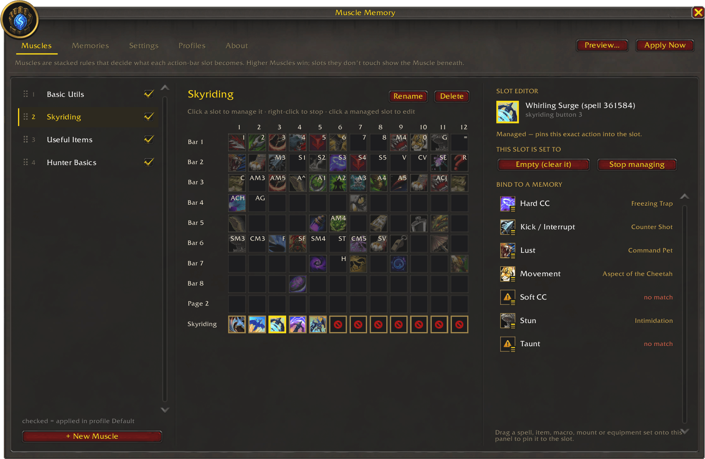
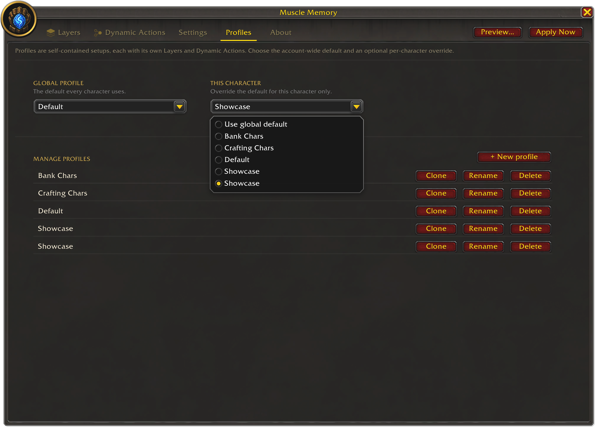

  

# Muscle Memory

**Bind buttons by purpose, not just spell.**

Muscle Memory keeps your action bars consistent across characters. You capture how your bars are
set up into reusable **action bar layers**, and Muscle Memory restores them on any character —
putting the right spell, item, macro, mount, or equipment set back into each slot.

Slots can also point to purpose-based **dynamic actions** such as Interrupt, Taunt, or Lust.
Each character gets whatever ability it actually has for that purpose, so one layer works across
many classes.

A dynamic action can also be rendered as a **macro** rather than a plain button — giving you
mouseover, focus, modifier, and conditional casts (`/use [@mouseover,help][@focus] %name%`) while
the dynamic action still resolves the right spell or item for each character. Muscle Memory writes
and maintains the per-character macro for you.

## Getting started

- Type **`/mm`** to open the window.
- Click a faded slot to capture whatever is on that action bar button right now.
- Switch character, then press **Apply** (or run `/mm apply`) to restore the layer.

## Commands

Everything in the window is also a slash command. The commands form a self-documenting tree —
type **`/mm help`**, or `/mm <topic> help`, to explore it. The essentials:

- `/mm` — open the window
- `/mm apply` — restore your bars from the active profile
- `/mm preview` — show what Apply would change, without touching your bars
- `/mm layer capture [slot|all]` — capture a live bar slot, or all of them, into the selected layer
- `/mm profile` · `/mm layer` · `/mm action` — manage profiles, action bar layers, and dynamic actions

## Screenshots

## Notes

- **Apply is blocked in combat** and while you're holding something on the cursor — it waits and
  tells you rather than half-applying.

## Contributing

See [CONTRIBUTING.md](CONTRIBUTING.md) for the development setup and how the add-on is structured.

## License

Released under the [MIT License](LICENSE).
