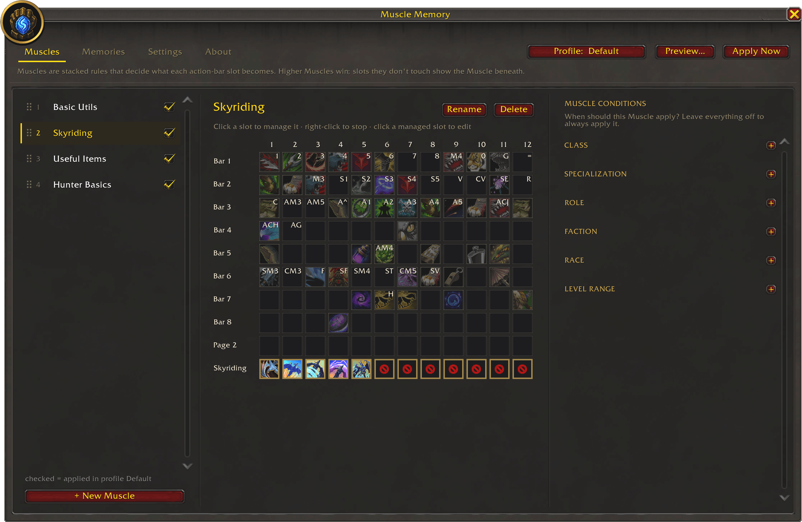
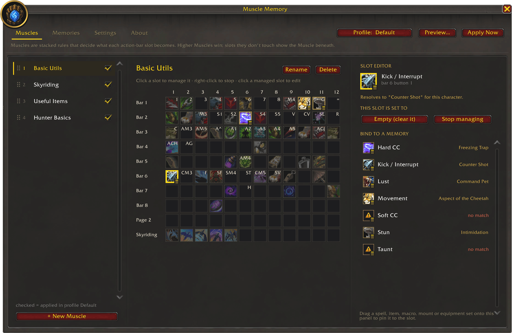
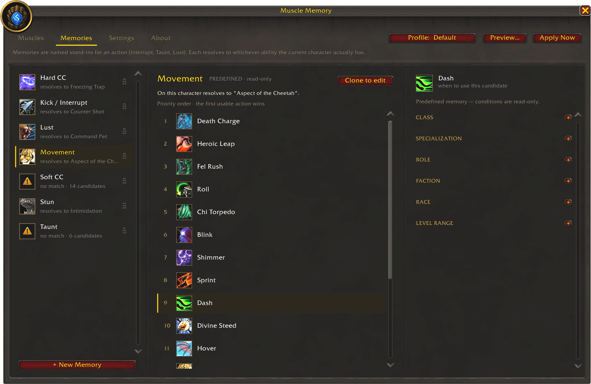
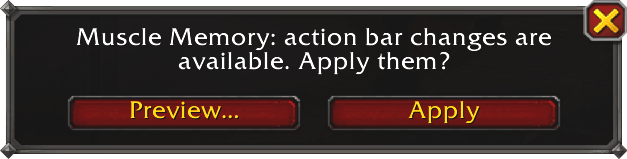

  

# Muscle Memory

**Bind buttons by purpose, not just spell.**

Muscle Memory keeps your action bars consistent across characters. You capture how your bars are
set up into reusable *muscles*, and Muscle Memory restores them on any character — putting the
right spell, item, macro, mount, or equipment set back into each slot.

Slots can also point to purpose-based **memories** such as Kick / Interrupt, Taunt, or Lust.
Each character gets whatever ability it actually has for that purpose, so one muscle works across
many classes.

## Getting started

- Type **`/mm`** to open the window.
- Click a faded slot to capture whatever is on that action bar button right now.
- Switch character, then press **Apply** (or run `/mm apply`) to restore the muscle.

## Commands

Everything in the window is also a slash command. The commands form a self-documenting tree —
type **`/mm help`**, or `/mm <topic> help`, to explore it. The essentials:

- `/mm` — open the window
- `/mm apply [profile]` — restore your bars from the active (or named) profile
- `/mm preview [profile]` — show what Apply would change, without touching your bars
- `/mm muscle capture [slot|all]` — capture a live bar slot, or all of them, into the selected muscle
- `/mm profile` · `/mm muscle` · `/mm memory` — manage profiles, muscles, and memories

## Screenshots

## Notes

- **Apply is blocked in combat** and while you're holding something on the cursor — it waits and
  tells you rather than half-applying.

## Contributing

See [CONTRIBUTING.md](CONTRIBUTING.md) for the development setup and how the add-on is structured.
